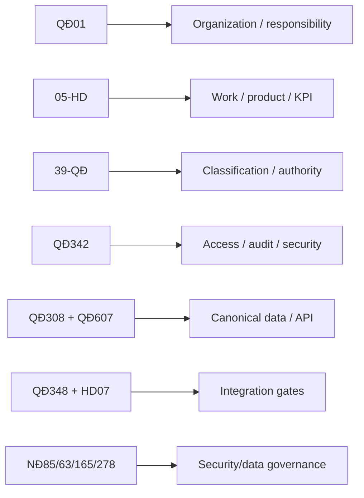

# 00 — Project overview

## Problem

Build an internal BTCTU system for task execution and KPI/evaluation, while respecting fragmented source rules about organization, quarterly assessment, classification, data governance, integration and security.

## What is now understood



The project is no longer blocked by “missing documents”; the core sources have been reviewed.

## What remains unresolved

- official JobPosition master;
- approved work-catalog effective version;
- 05-HD arithmetic inconsistency;
- non-manager KPI formula;
- month→quarter→year aggregation;
- QĐ39 excellent-rating comparison group;
- production data classification / formal HTTT level;
- exact real integration scope.

## Product direction [INFERENCE]

Prototype:

- internal web app;
- modular monolith;
- relational DB;
- synthetic data;
- versioned work/scoring/classification rules;
- contextual permission + audit;
- fake connector.

Production architecture remains subject to formal security/data/integration approvals.

## Main delivery path

```text
Source analysis
→ Traceability
→ Business/domain model
→ System design
→ Vertical-slice implementation
→ Demo
→ Production-readiness plan
```

## Interview value

The project demonstrates:

- requirements/business analysis from regulations;
- ability to detect ambiguity/source defects;
- domain and data modeling;
- architecture/security tradeoffs;
- explicit separation of “known”, “designed” and “not yet authorized”.
