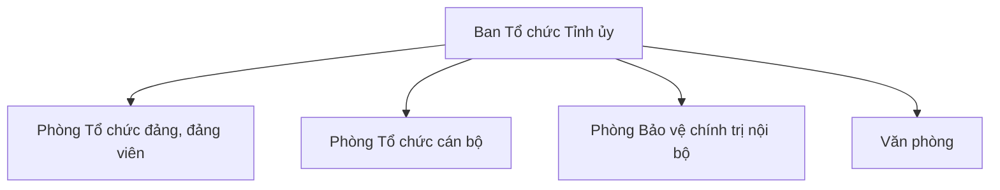

# SRC-01 — Phân tích văn bản 01-QĐ/BTCTU

> Tiêu đề: **Chức năng, nhiệm vụ và cơ cấu tổ chức các phòng thuộc Ban Tổ chức Tỉnh ủy**
> Số hiệu: **01-QĐ/BTCTU** — ngày **28/11/2025** `[FACT theo trích dẫn trong phân tích; cần đối chiếu toàn văn PDF khi file được đưa vào repo]`

## 1. Văn bản này cho ta cái gì?

QĐ01 cung cấp:

1. Bản đồ tổ chức: 1 cơ quan + 4 đơn vị `[FACT]`
2. Cơ cấu thành phần của từng đơn vị `[FACT]`
3. Chức năng và danh mục nhiệm vụ của từng phòng `[FACT]`
4. Một quy tắc nghiệp vụ về phân công công việc `[FACT]`

Văn bản **không** cung cấp workflow nghiệp vụ chi tiết, task model, hay bất kỳ thứ gì về KPI `[FACT-negative]`.

## 2. Cơ cấu tổ chức `[FACT]`

Thành phần của từng đơn vị theo văn bản:

| Đơn vị | Thành phần được nêu |
|---|---|
| Phòng Tổ chức đảng, đảng viên | Trưởng phòng, Phó Trưởng phòng, Công chức |
| Phòng Tổ chức cán bộ | Trưởng phòng, Phó Trưởng phòng, Công chức |
| Phòng Bảo vệ chính trị nội bộ | Trưởng phòng, Phó Trưởng phòng, Công chức, Cán bộ công an biệt phái |
| Văn phòng | Chánh Văn phòng, Phó Chánh Văn phòng, Công chức, Người lao động |

Điểm quan trọng:

- Đây là **cơ cấu thành phần** (nhóm chức danh/nhóm nhân sự), **không phải danh mục vị trí việc làm** `[FACT-negative]`.
- Văn bản có nhắc đến "vị trí việc làm" nhưng **không liệt kê** các vị trí việc làm cụ thể → chưa thể xây master data `Position` `[TBD]`.
- Mỗi phòng được quy định gồm: **chức năng, nhiệm vụ, cơ cấu tổ chức** `[FACT]`.

## 3. Chức năng

### 3.1 Chức năng chung `[FACT một phần]`

Các phòng thuộc Ban đều có chức năng, nhiệm vụ **tham mưu, giúp việc lãnh đạo Ban** (Điều 2 — theo trích dẫn trong phân tích). Phần liệt kê đầy đủ các lĩnh vực tham mưu chưa được trích trọn vẹn → `[TBD: đối chiếu toàn văn Điều 2]`.

### 3.2 Chức năng từng phòng

| Đơn vị | Chức năng | Nhãn |
|---|---|---|
| Phòng Tổ chức đảng, đảng viên | Tham mưu về tổ chức đảng, công tác đảng viên và nghiệp vụ công tác đảng viên | `[FACT]` |
| Phòng Tổ chức cán bộ | Tham mưu về công tác tổ chức, cán bộ; công tác chính sách cán bộ **(trừ các nhiệm vụ đã giao cho Văn phòng)** | `[FACT]` |
| Phòng Bảo vệ chính trị nội bộ | Chưa có câu chức năng được trích trong phân tích hiện tại | `[TBD: đối chiếu]` |
| Văn phòng | Đầu mối tham mưu, giúp lãnh đạo Ban xử lý công việc **hằng ngày** (trích một phần) | `[FACT một phần]` |

> Ranh giới nghiệp vụ đáng chú ý: chính sách cán bộ nằm ở Phòng Tổ chức cán bộ, **trừ phần đã giao cho Văn phòng** `[FACT]`. Ranh giới này sẽ ảnh hưởng trực tiếp đến thiết kế phân quyền và phân vùng dữ liệu về sau `[INFERENCE]`.

## 4. Nhiệm vụ từng phòng

Các mục dưới đây là nội dung **có căn cứ trong văn bản** `[FACT từng mục]`. Việc gom nhóm và đánh số là **cách tổng hợp của nhóm phân tích**, không phải taxonomy chính thức do văn bản định nghĩa `[INFERENCE]`.

### 4.1 Phòng Tổ chức đảng, đảng viên

- Thi hành Điều lệ Đảng
- Xây dựng văn bản, đề án về tổ chức đảng, đảng viên
- Thẩm định đề án, văn bản về tổ chức đảng, đảng viên
- Kiểm tra, giám sát
- Hướng dẫn nghiệp vụ
- Theo dõi việc thực hiện quy chế làm việc của cấp ủy đảng các cấp
- Quản lý hồ sơ đảng viên
- Quản lý dữ liệu đảng viên
- Kết nạp đảng viên; giới thiệu sinh hoạt đảng; xét tặng Huy hiệu Đảng; cấp phát thẻ đảng viên; xóa tên đảng viên; giải quyết khiếu nại; vấn đề đảng tịch
- Đánh giá, xếp loại tổ chức đảng và đảng viên
- Khen thưởng
- Đại hội tổ chức đảng
- Thống kê, báo cáo
- Chuyển đổi số, CNTT
- Phối hợp với các cơ quan liên quan
- Nhiệm vụ khác do lãnh đạo giao

### 4.2 Phòng Tổ chức cán bộ

- Tổ chức bộ máy
- Biên chế
- Quản lý cán bộ
- Tuyển chọn cán bộ
- Quy hoạch cán bộ
- Nhận xét, đánh giá
- Bố trí, phân công
- Bổ nhiệm, bổ nhiệm lại; giới thiệu ứng cử; tái cử; chỉ định
- Điều động
- Luân chuyển
- Biệt phái
- Miễn nhiệm, từ chức, cho thôi giữ chức vụ
- Tạm đình chỉ, đình chỉ chức vụ
- Kỷ luật
- Hồ sơ cán bộ
- Thẩm định nhân sự
- Thẩm định đề án, văn bản; tham gia ý kiến đối với đề án, văn bản
- Đào tạo, bồi dưỡng
- Chính sách cán bộ (trừ phần giao Văn phòng)
- Tiền lương
- Thi nâng ngạch; xét thăng hạng nghề nghiệp
- Kiểm tra, giám sát
- Thống kê, báo cáo
- CNTT, chuyển đổi số
- Phối hợp với các cơ quan liên quan

### 4.3 Phòng Bảo vệ chính trị nội bộ

- Xây dựng văn bản, đề án
- Kiểm tra, giám sát
- Thẩm định
- Thẩm tra, xác minh
- Xử lý vấn đề chính trị đối với cán bộ, đảng viên
- Quản lý hồ sơ BVCTNB
- Tiếp nhận, xử lý đơn thư
- Phối hợp với các cơ quan liên quan
- Báo cáo định kỳ, đột xuất; sơ kết, tổng kết
- CNTT, chuyển đổi số
- Theo dõi cán bộ có liên quan yếu tố nước ngoài
- Theo dõi cán bộ được cử đi công tác, tham quan, đào tạo ở nước ngoài
- Nhiệm vụ khác được giao

> Chỉnh so với nháp ban đầu: không dùng "thống kê" cho phòng này — văn bản nói **báo cáo định kỳ, đột xuất; sơ kết, tổng kết** `[FACT]`.

### 4.4 Văn phòng

- Tổng hợp chương trình, kế hoạch
- Phối hợp hoạt động giữa các phòng
- Đầu mối phối hợp triển khai chương trình, kế hoạch và chế độ thông tin, báo cáo
- Theo dõi, đôn đốc việc thực hiện chế độ thông tin, báo cáo theo phạm vi được giao
- Chế độ báo cáo
- Hội họp, biên bản, kết luận
- Văn thư, lưu trữ
- Hành chính
- Tài chính
- Tài sản, cơ sở vật chất
- Chăm sóc sức khỏe cán bộ; chế độ tang lễ; giải quyết đơn thư, kiến nghị liên quan
- Chăm lo đời sống vật chất, tinh thần và chế độ chính sách cho cán bộ, công chức, người lao động
- Công tác nhân sự nội bộ của Ban: hợp đồng lao động, tuyển dụng, quy hoạch, đào tạo, bồi dưỡng, điều động, bổ nhiệm, bổ nhiệm lại, nâng bậc lương, thi đua, khen thưởng, kỷ luật, bảo hiểm xã hội… đối với cán bộ, công chức, người lao động của Ban
- Tiếp khách, công tác, đối ngoại
- Phòng chống tham nhũng
- Thi đua, khen thưởng
- Cải cách hành chính
- CNTT, chuyển đổi số
- Văn hóa công sở
- Tổng hợp, đôn đốc
- Đầu mối tham mưu, giúp lãnh đạo Ban xử lý công việc hằng ngày

> Chỉnh so với nháp ban đầu: "theo dõi tiến độ công việc các phòng" là **suy luận**, không dùng trong bản fact-only — văn bản nói **phối hợp hoạt động giữa các phòng** và **theo dõi, đôn đốc chế độ thông tin, báo cáo theo phạm vi được giao** `[FACT]`.

## 5. Quy tắc phân công công việc `[FACT]`

> **Chánh Văn phòng, Trưởng các phòng** có trách nhiệm **phân công nhiệm vụ cụ thể** cho công chức, người lao động của phòng, **gắn với vị trí việc làm** của từng thành viên.

> Nếu trong quá trình triển khai có vướng mắc thì **báo cáo lãnh đạo Ban (qua Văn phòng)** để xem xét sửa đổi, bổ sung kịp thời.

Cảnh báo khi mô hình hóa:

- Văn bản quy trách nhiệm phân công cho Trưởng phòng/Chánh Văn phòng, nhưng **không nói "chỉ"** hai chức danh này được phép phân công trong mọi trường hợp → không suy ra permission exclusivity `[INFERENCE warning]`.
- Mô hình `DepartmentHead → assigns → Task → Employee` là **cách diễn giải của nhóm**, không phải khái niệm văn bản định nghĩa `[INFERENCE]`.

## 6. Nhắc tới nhưng chưa định nghĩa `[FACT-negative]`

| Khái niệm | Văn bản có gì? | Hệ quả thiết kế |
|---|---|---|
| Vị trí việc làm | Nhắc tới, không liệt kê danh mục | Chưa tạo master `JobPosition` `[TBD]` |
| Các dạng hoạt động (xây dựng văn bản, thẩm định, kiểm tra, hướng dẫn, quản lý hồ sơ, báo cáo, phối hợp…) | Xuất hiện lặp lại trong nhiệm vụ các phòng | Không coi là Task taxonomy `[TBD]` |
| "Tổ chức hội nghị" | Chỉ có: cử công chức dự họp/hội nghị, tham dự cuộc họp, ghi biên bản, phục vụ hội họp | Không đưa "tổ chức hội nghị" vào catalog |
| Các mốc thời gian: tuần, tháng, quý, 6 tháng, 9 tháng, năm, nhiệm kỳ, định kỳ, đột xuất, hằng ngày | Xuất hiện trong mô tả chương trình/kế hoạch và chế độ báo cáo | Không suy ra enum `Cycle` của Task `[TBD]` |

## 7. Hoàn toàn không có trong văn bản `[FACT-negative]`

- Công thức KPI, trọng số KPI, thang điểm, cách tính số lượng / chất lượng / tiến độ
- Workflow submit → review → approve
- Ai được sửa điểm
- Task có những trạng thái nào; deadline của từng loại task
- Minh chứng bắt buộc là gì
- Cách xếp loại; cách tổng hợp kết quả tháng/quý/năm

→ Nếu code các phần trên chỉ dựa vào QĐ01 là **tự phát minh nghiệp vụ**. Chúng chờ 05-HD/TU và 39-QĐ/TU.

## 8. Tác động thiết kế `[INFERENCE]`

### 8.1 Đủ căn cứ để thiết kế

- Module **Organization Management**: Organization, Department, Employee ↔ Department
- **Responsibility catalog** gắn nguồn văn bản cho từng nhiệm vụ
- **Assignment abstraction**: `department_id`, `assignee_id`, `assigned_by`, `job_position_id`

### 8.2 Chưa đủ căn cứ — hoãn thiết kế `[TBD]`

- `JobPosition` master: chờ danh mục vị trí việc làm
- Task definition, task states: chờ 05-HD/TU
- KPI, cách tính điểm: chờ 05-HD/TU
- Đánh giá, xếp loại, phê duyệt: chờ 39-QĐ/TU
- Permission matrix: chờ văn bản an ninh/BVCTNB
- Dashboard/report liên phòng: gợi ý từ vai trò tổng hợp của Văn phòng `[INFERENCE]`, chờ xác nhận

## 9. Hạt giống traceability

| Nguồn | Nội dung | Domain | Module | Nhãn |
|---|---|---|---|---|
| QĐ01 | Ban có 4 đơn vị | Organization, Department | Organization Mgmt | FACT |
| QĐ01 | Cơ cấu thành phần mỗi đơn vị | Composition / title | Organization Mgmt | FACT |
| QĐ01 | Chức năng từng phòng | Function | Responsibility Mgmt | FACT |
| QĐ01 | Danh mục nhiệm vụ từng phòng | Responsibility | Responsibility Mgmt | FACT |
| QĐ01 | Phân công gắn vị trí việc làm | Assignment | Assignment Mgmt | FACT (rule) / INFERENCE (thiết kế) |
| QĐ01 | "Vị trí việc làm" (chưa có danh mục) | JobPosition | — | TBD |
| 05-HD/TU | Task, KPI, chấm điểm (dự kiến) | Task, KPI | Task/KPI Mgmt | TBD |
| 39-QĐ/TU | Đánh giá, xếp loại (dự kiến) | Evaluation | Evaluation Mgmt | TBD |

