# 02.2 — Bản đồ năng lực nghiệp vụ (Business Capability Map)

Mục đích: trả lời câu hỏi **hệ thống cần bao phủ những lĩnh vực nghiệp vụ nào**. Đây **không phải workflow**, không phải danh sách task.

Nguồn: QĐ01 — danh mục nhiệm vụ từng phòng `[FACT từng mục]`. Việc gom nhóm thành các cụm năng lực là của nhóm phân tích `[INFERENCE]`.

```mermaid
flowchart TD
    BTCTU["Ban Tổ chức Tỉnh ủy"]
    C1["Tổ chức đảng & đảng viên"]
    C2["Tổ chức cán bộ"]
    C3["Bảo vệ chính trị nội bộ"]
    C4["Văn phòng — tổng hợp & hành chính"]
    BTCTU --> C1
    BTCTU --> C2
    BTCTU --> C3
    BTCTU --> C4
    C1 --> C11["Tổ chức đảng"]
    C1 --> C12["Công tác đảng viên"]
    C1 --> C13["Kiểm tra / hướng dẫn / thẩm định"]
    C1 --> C14["Hồ sơ & dữ liệu đảng viên"]
    C1 --> C15["Đánh giá / khen thưởng / đại hội"]
    C2 --> C21["Bộ máy & biên chế"]
    C2 --> C22["Cán bộ (quy hoạch, bổ nhiệm, điều động…)"]
    C2 --> C23["Hồ sơ & chính sách cán bộ"]
    C2 --> C24["Đào tạo / tiền lương / ngạch"]
    C3 --> C31["Thẩm định / thẩm tra / xác minh"]
    C3 --> C32["Hồ sơ BVCTNB"]
    C3 --> C33["Đơn thư"]
    C3 --> C34["Theo dõi yếu tố nước ngoài"]
    C4 --> C41["Tổng hợp / kế hoạch / báo cáo"]
    C4 --> C42["Văn thư / hành chính / tài chính"]
    C4 --> C43["Nhân sự nội bộ của Ban"]
    C4 --> C44["Phục vụ lãnh đạo Ban"]
```

## Bảng năng lực theo đơn vị

| Đơn vị | Cụm năng lực | Minh họa nhiệm vụ (QĐ01) | Nhãn |
|---|---|---|---|
| Phòng Tổ chức đảng, đảng viên | Tổ chức đảng; công tác đảng viên | Thi hành Điều lệ Đảng; kết nạp; Huy hiệu Đảng; thẻ đảng viên; đảng tịch | FACT |
| Phòng Tổ chức đảng, đảng viên | Hồ sơ & dữ liệu | Quản lý hồ sơ, dữ liệu đảng viên | FACT |
| Phòng Tổ chức đảng, đảng viên | Đánh giá, khen thưởng, đại hội | Đánh giá xếp loại; khen thưởng; đại hội tổ chức đảng | FACT |
| Phòng Tổ chức cán bộ | Bộ máy & biên chế | Tổ chức bộ máy; biên chế | FACT |
| Phòng Tổ chức cán bộ | Vòng đời cán bộ | Quy hoạch; bổ nhiệm; điều động; luân chuyển; miễn nhiệm; kỷ luật | FACT |
| Phòng Tổ chức cán bộ | Hồ sơ & chính sách | Hồ sơ cán bộ; thẩm định nhân sự; chính sách cán bộ | FACT |
| Phòng Tổ chức cán bộ | Đào tạo & lương | Đào tạo, bồi dưỡng; tiền lương; nâng ngạch, thăng hạng | FACT |
| Phòng BVCTNB | Thẩm định & xác minh | Thẩm định; thẩm tra, xác minh | FACT |
| Phòng BVCTNB | Hồ sơ nhạy cảm | Hồ sơ BVCTNB; đơn thư | FACT |
| Phòng BVCTNB | Theo dõi đặc thù | Yếu tố nước ngoài; công tác nước ngoài | FACT |
| Văn phòng | Tổng hợp & báo cáo | Chương trình, kế hoạch; chế độ thông tin, báo cáo | FACT |
| Văn phòng | Hành chính & hậu cần | Văn thư, lưu trữ; hành chính; tài chính; tài sản | FACT |
| Văn phòng | Nhân sự nội bộ | Hợp đồng, tuyển dụng, lương, thi đua, BHXH… cho cán bộ của Ban | FACT |
| Văn phòng | Phục vụ lãnh đạo | Đầu mối tham mưu, xử lý công việc hằng ngày | FACT |

## Điều capability map chưa nói được `[TBD]`

- Workflow cụ thể của từng năng lực (ai → làm gì → ai duyệt)
- Sản phẩm đầu ra (văn bản gì, biểu mẫu gì)
- Tần suất/chu kỳ bắt buộc của từng loại công việc
- Chỉ số đo lường (KPI) của từng năng lực

→ Các câu hỏi này cần 05-HD/TU và 39-QĐ/TU.

