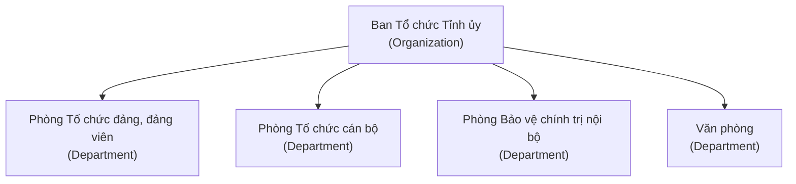

# 02.1 — Mô hình tổ chức

> Toàn bộ nội dung mục này lấy từ QĐ01. Chi tiết và bằng chứng: [01-source-analysis/QD01…](../01-source-analysis/QD01-chuc-nang-nhiem-vu-co-cau-to-chuc.md).

## Sơ đồ tổ chức `[FACT]`

## Cơ cấu thành phần `[FACT]`

| Đơn vị | Trưởng đơn vị | Cấp phó | Thành viên khác |
|---|---|---|---|
| Phòng Tổ chức đảng, đảng viên | Trưởng phòng | Phó Trưởng phòng | Công chức |
| Phòng Tổ chức cán bộ | Trưởng phòng | Phó Trưởng phòng | Công chức |
| Phòng Bảo vệ chính trị nội bộ | Trưởng phòng | Phó Trưởng phòng | Công chức; Cán bộ công an biệt phái |
| Văn phòng | Chánh Văn phòng | Phó Chánh Văn phòng | Công chức; Người lao động |

Lưu ý:

- Các nhãn cột "Trưởng đơn vị / Cấp phó / Thành viên" là **cách đặt tên của nhóm** `[INFERENCE]`; văn bản chỉ liệt kê thành phần, không định nghĩa hierarchy hay quyền hạn.
- Đây không phải danh mục **vị trí việc làm** `[FACT-negative]`. Master `JobPosition` là `[TBD]`.

## Khái niệm cốt lõi

| Khái niệm | Định nghĩa theo QĐ01 | Nhãn |
|---|---|---|
| Organization | Ban Tổ chức Tỉnh ủy — cấp cơ quan | FACT |
| Department | 4 phòng thuộc Ban | FACT |
| Composition | Thành phần nhân sự của từng phòng (Trưởng/Phó phòng, công chức…) | FACT |
| Function | Lĩnh vực tham mưu, giúp việc của từng phòng | FACT |
| Responsibility | Nhóm nhiệm vụ của từng phòng | FACT |
| JobPosition | Vị trí việc làm — được nhắc tới, chưa có danh mục | TBD |
| Assignment | Phân công nhiệm vụ cụ thể của Chánh VP/Trưởng phòng cho thành viên | FACT (rule) / INFERENCE (mô hình) |

## Ranh giới giữa các đơn vị `[FACT]`

- Công tác **chính sách cán bộ** thuộc Phòng Tổ chức cán bộ, **trừ các nhiệm vụ đã giao cho Văn phòng** → hai đơn vị chia sẻ một miền nghiệp vụ, cần thiết kế ranh giới dữ liệu rõ ràng `[INFERENCE]`.
- Phòng BVCTNB có **cán bộ công an biệt phái** và dữ liệu nhạy cảm (hồ sơ BVCTNB) → tách biệt phân vùng dữ liệu `[INFERENCE]`.
- Văn phòng là **đầu mối phối hợp** và **tổng hợp, đôn đốc chế độ thông tin, báo cáo** → vai trò xuyên phòng, ảnh hưởng thiết kế dashboard/report `[FACT vai trò] / [INFERENCE thiết kế]`.

