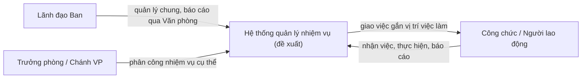

# 03.1 — Tổng quan kiến trúc (sơ bộ)

> Trạng thái: **sơ bộ**. Chỉ những module có căn cứ từ QĐ01 được chốt; phần còn lại là placeholder. Xem thêm [ADR](../04-adr/README.md).

## Nguyên tắc thiết kế

1. **Traceability**: mọi quy tắc hệ thống phải truy về văn bản nguồn `[INFERENCE]`.
2. **Không phát minh nghiệp vụ**: chưa có nguồn thì để `[TBD]`, không dựng giả `[INFERENCE]`.
3. **Module theo ranh giới đơn vị**: miền nghiệp vụ có ranh giới rõ (QĐ01), dữ liệu BVCTNB nhạy cảm cần tách phân vùng `[FACT ranh giới] → [INFERENCE thiết kế]`.

## Sơ đồ ngữ cảnh (context) `[INFERENCE]`

Lưu ý: bản vẽ trên là **cách diễn giải software từ quy tắc phân công của QĐ01**, không phải sơ đồ có sẵn trong văn bản `[INFERENCE]`.

## Ranh giới module sơ bộ

| Module | Phạm vi | Căn cứ | Trạng thái |
|---|---|---|---|
| Organization Management | Organization, Department, Employee, cơ cấu | QĐ01 | ✅ Chốt `[FACT nền] + [INFERENCE thiết kế]` |
| Responsibility Management | Function, Responsibility, catalog gắn nguồn | QĐ01 | ✅ Chốt `[FACT nền] + [INFERENCE thiết kế]` |
| Assignment Management | Phân công gắn vị trí việc làm (skeleton) | QĐ01 rule | 🟡 Skeleton `[INFERENCE]` |
| JobPosition Master | Danh mục vị trí việc làm | QĐ01 nhắc, không liệt kê | ⏸ Placeholder `[TBD]` |
| Task Management | Task, trạng thái, deadline | Chưa có nguồn | ⏸ Placeholder `[TBD]` |
| KPI Management | Công thức, trọng số, chấm điểm | Chưa có nguồn | ⏸ Placeholder `[TBD]` |
| Evaluation & Approval | Quy trình đánh giá, xếp loại, phê duyệt | Chưa có nguồn | ⏸ Placeholder `[TBD]` |
| Reporting | Báo cáo định kỳ/đột xuất, tổng hợp | QĐ01 (Văn phòng là đầu mối) | 🟡 Định hướng `[FACT vai trò] + [TBD chi tiết]` |
| Security & Access Control | Phân quyền, phân vùng dữ liệu | Văn bản an ninh (chưa có) | ⏸ Placeholder `[TBD]` |

## Câu hỏi kiến trúc mở `[TBD]`

- Web app hay desktop app? (ADR-0004)
- Triển khai nội bộ (on-premise) hay thuê dịch vụ?
- Tích hợp với hệ thống CNTT hiện có của Tỉnh ủy?
- Mức độ phân quyền cho dữ liệu BVCTNB?

→ Cần văn bản CNTT/chuyển đổi số và văn bản an ninh.

