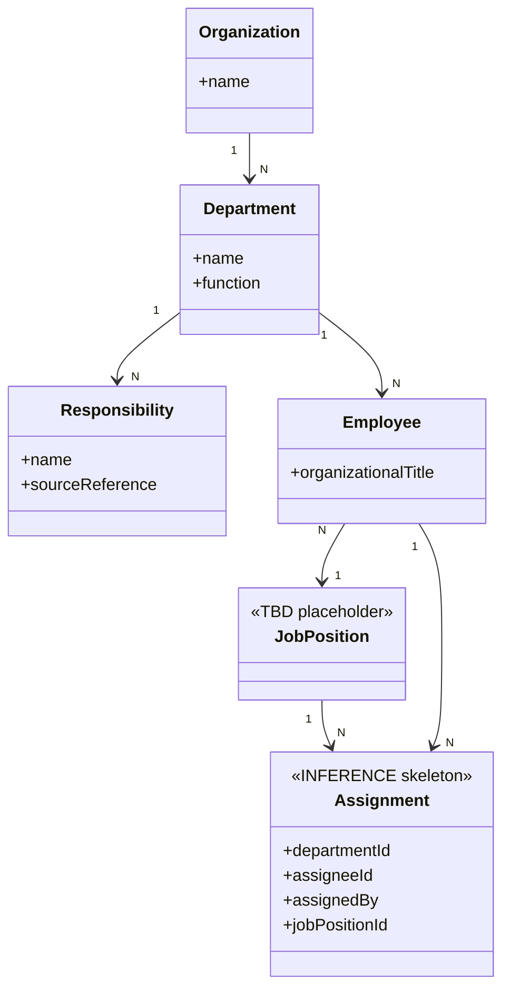

# 03.2 — Domain model (một phần)

> Chỉ mô hình các tầng có căn cứ từ QĐ01. Chi tiết phân tích: [QD01…](../01-source-analysis/QD01-chuc-nang-nhiem-vu-co-cau-to-chuc.md).

## Phân tầng khái niệm `[FACT 3 tầng đầu] / [TBD các tầng sau]`

```text
Organization                    [FACT]
    ↓
Department                      [FACT]
    ↓
Function → Responsibility       [FACT]
    ↓
Task Definition                 [TBD — chờ 05-HD/TU]
    ↓
Task Assignment                 [TBD — skeleton từ QĐ01 rule]
```

## Sơ đồ khái niệm cốt lõi



## Giải thích từng khối

| Khối | Nhãn | Ghi chú |
|---|---|---|
| Organization → Department | FACT | Ban có 4 phòng |
| Department → Function → Responsibility | FACT | Chức năng + danh mục nhiệm vụ |
| Employee + organizationalTitle | FACT | Trưởng/Phó phòng, công chức… là cơ cấu thành phần, không phải danh mục vị trí |
| JobPosition | TBD | QĐ01 nhắc "vị trí việc làm" nhưng không liệt kê; không được bịa danh mục |
| Assignment | INFERENCE | Skeleton từ quy tắc phân công; chưa thêm deadline/score/quality/status/evidence/KPI vì QĐ01 chưa định nghĩa |
| Task | TBD | Chưa định nghĩa; giữ dạng aggregate chưa xác định, chờ 05-HD/TU |

