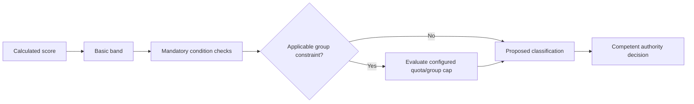

# Classification rules

## FACT — QĐ39

### Basic score bands

| Classification | Basic score |
|---|---:|
| Hoàn thành xuất sắc nhiệm vụ | >= 90 |
| Hoàn thành tốt nhiệm vụ | >= 70 and < 90 |
| Hoàn thành nhiệm vụ | >= 50 and < 70 |
| Không hoàn thành nhiệm vụ | < 50 or a blocking case applies |

Source: QĐ39, Điều 11.

## Score is not enough

Each class contains additional mandatory conditions. Examples include:

- completion ratio of assigned tasks;
- quality/timeliness;
- outstanding-result requirements for excellent rating;
- conditions tied to the performance of a unit/area/subordinates for leaders;
- violation/discipline cases;
- a group-level quota/cap on excellent ratings **when the subject category and
  comparison scope make that rule applicable**.

Quota applicability must be resolved from the configured subject category and
comparison group. It is not a universal step for every evaluation.

Therefore this is invalid:

```ts
if (score >= 90) return "EXCELLENT";
```

## Proposed decision pipeline [INFERENCE]



## Candidate rule representation

```text
ClassificationRuleVersion
- version/effective period
- sourceRef
- subjectType
- scoreBands[]
- mandatoryConditions[]
- blockers[]
- groupQuotaRule?
- roundingPolicy
- status
```

A small deterministic evaluator is enough for MVP. Do not build a generic DSL/rules engine unless the rule set proves it necessary.

`groupQuotaRule?` is optional. Absence means the evaluation bypasses quota
checking; it must not be interpreted as an implicit global quota.

## TBD

- exact comparison group for the excellent-rating cap inside BTCTU;
- precise mapping of each QĐ39 subject category to demo users;
- local procedure for appeal/reopen/correction after publication;
- official monthly-to-quarter/year aggregation rule for the test system.
