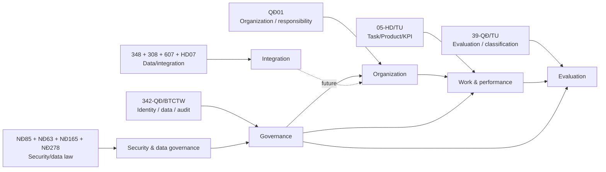

# Business domain map và traceability

## Domain map



## Core business capabilities

| Capability | Source basis | Status |
|---|---|---|
| Organization / department / responsibility | QĐ01 Điều 2–7 | Source-backed |
| Position/person assignment context | QĐ01 + Excel operational | Position master still needs authoritative confirmation |
| Work/product catalog | 05-HD Phụ lục 1 + Excel draft + QĐ308 task fields | Source-backed concept; catalog values need approval/version |
| Task execution/result | 05-HD task/product measurement | Software model required |
| KPI 30/70 and A/B/C/D for leaders | 05-HD | Source-backed; worked-example arithmetic has inconsistency |
| Self assessment / review / final decision | 05-HD + QĐ39 | Source-backed stages |
| Classification thresholds + blockers | QĐ39 Điều 11 | Source-backed |
| Person + collective evaluation | Đề bài + QĐ39 | Source-backed subject types; calculation of collective score still needs configuration |
| Permission/data scope/audit | QĐ342 | Source-backed constraints |
| Canonical dictionary | QĐ308 | Source-backed |
| External API contract | QĐ607 | Future integration |
| Connection security/process | QĐ348 + HD07 | Future integration / production gate |
| Security level & protected data | NĐ85 + NĐ63 + QĐ342/348 | Formal production decision remains TBD |

## Central mental model

```text
Organization
   ↓
Department
   ↓
Responsibility / Position
   ↓
WorkCatalogVersion
   ↓
Task / Assignment
   ↓
TaskResult / Product / EvidenceRef
   ↓
Performance metrics
   ↓
Evaluation (30 + 70)
   ↓
Classification eligibility
   ↓
Review / Final decision
   ↓
Lock / Audit / Report
```

The arrows after `Responsibility` are **software interpretation** built from multiple sources; they are not one pre-existing workflow diagram in any single document.
