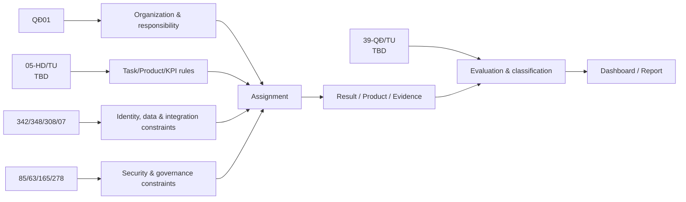

# Business domain map và traceability

| Capability | Source basis | Status |
|---|---|---|
| Organization/department/responsibility | QĐ01 Điều 2–6 | Ready for implementation |
| Assignment linked to member/position | QĐ01 Điều 7.2 | Skeleton ready; task semantics TBD |
| Product/evidence/KPI | Expected from 05-HD/TU | Blocked |
| Evaluation/classification/approval | Expected from 39-QĐ/TU | Blocked |
| Identity, permission, audit, dashboard layers | QĐ342 Điều 6–7 | Architecture constraint |
| Data sharing | QĐ348, QĐ308, HD07 | Future integration boundary |
| Security level/secrecy/data governance | NĐ85/63/165/278 | Production gate |

