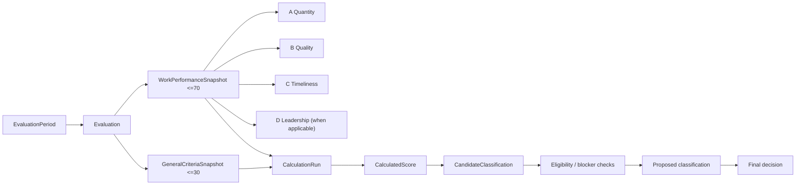

# Evaluation / KPI model

## FACT from 05-HD/TU

### Score structure

```text
General criteria               max 30
Work-performance results       max 70
------------------------------------
Total                          max 100
```

For leaders/managers, Phụ lục 2 presents:

```text
KPI = (A + B + C + D) / 4

A = Quantity
B = Quality
C = Timeliness
D = Leadership / direction / organization of work
```

The KPI percentage is used to calculate the work-performance block.

### Evaluation stages

05-HD/TU also states:

1. define objectives/tasks/products;
2. self-score/evaluate/propose classification;
3. direct competent level reviews/evaluates/proposes;
4. competent authority decides;
5. notify/store result.

## SOURCE INCONSISTENCY — worked-example arithmetic inconsistency

The worked example gives:

- KPI = 82.3%;
- general score = 30;
- then prints `30 + (82.3% × 70) = 80.3`.

Arithmetic gives **87.61**, not 80.3. This identifies an inconsistency in the
worked example; it does not by itself prove that the official formula is wrong.

Project treatment:

- record discrepancy;
- do not silently “correct the law/source”;
- scoring rule remains versioned and requires confirmation;
- include regression/unit test once approved.

## FACT from QĐ39

Final classification depends on **threshold + mandatory conditions/blockers**, not only score.

Therefore the model must separate calculation from classification decision.

## Proposed model [INFERENCE]



### Required invariants

- calculation keeps exact rule version and input snapshot;
- recalculation creates a new run; does not mutate old approved run;
- self score, reviewer score/proposal and final decision are distinct;
- manual override requires reason, actor, authority and audit;
- finalized period is immutable except through explicit reopen procedure.

## Individual vs collective

The assignment requires evaluation for both individuals and departments, while
QĐ39 covers collective and individual evaluation. From those two inputs,
`EvaluationSubject` is a proposed software abstraction [INFERENCE] supporting:

- `PERSON`
- `DEPARTMENT`

`DEPARTMENT` is therefore a design-derived entity name, not an entity explicitly
defined by QĐ39. Department evaluation is a separate subject. **Do not define
department score as average employee score** unless an approved rule explicitly
requires it.

## Staff/non-manager formula — TBD

05-HD’s explicit A/B/C/D example targets leaders/managers. The assignment requires evaluation of all staff.

Candidate approach:

- use a separate `ScoringRuleVersion` for non-manager positions;
- derive it from approved business clarification/catalog;
- do not silently drop D and average A/B/C while labeling that as source FACT.

## Periods

- quarterly process is explicitly source-backed by 05-HD;
- annual classification is covered by QĐ39;
- the test asks for month/quarter/year.

Monthly score can be designed as an operational measurement layer feeding quarterly evaluation, but its exact official aggregation is **TBD/design choice**, not a direct rule from these sources.
