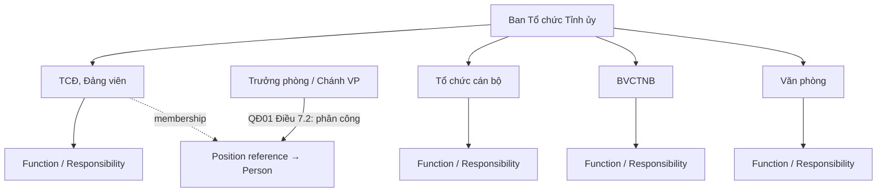

# Organization / responsibility model

- `[FACT]` QĐ01 quy định bốn phòng, chức năng/nhiệm vụ/cơ cấu và trách nhiệm phân công.
- `[INFERENCE]` `Responsibility` là catalog có version/source; `Membership` tách người khỏi phòng để giữ lịch sử.
- `[TBD]` danh mục vị trí việc làm và delegation/ủy quyền.

