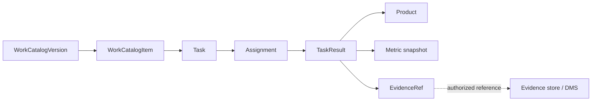

# Task / product / evidence model

## Source-backed concepts

### FACT

From QĐ01:

- department heads / Chánh Văn phòng have responsibility to assign concrete work to members linked to job positions.

From 05-HD/TU, especially Phụ lục 1:

- evaluation is based on assigned work and output products;
- a standard work/product catalog may include unit of product, standard point, conversion coefficient, complexity/impact and execution time.

From QĐ308:

- `MaNhiemVu` and `TenNhiemVu` are standardized core data elements.

From the operational Excel:

- there is an actual draft catalog with work code, work name, product, complexity, max duration, score, conversion coefficient and explanation;
- this workbook is **operational/draft data**, not automatically an approved rule.

## Proposed domain model [INFERENCE]

### WorkCatalogVersion

Stores a published set of work definitions:

- version;
- effective period;
- source references;
- approval/status;
- checksum/import origin.

### WorkCatalogItem

Candidate fields:

- `code` — mapped to canonical task code where applicable;
- `name`;
- `responsibilityId`;
- `expectedProduct`;
- `standardUnit`;
- `complexity`;
- `standardDuration`;
- `standardScore`;
- `conversionCoefficient`;
- `sourceRef`.

### Task

An actual work instance. It is **not** the same as the catalog item. Candidate fields:

- task identity;
- selected catalog item/version;
- title/description;
- owning department;
- period;
- source/origin;
- created/assigned timestamps.

### Assignment

Separates work from assignee:

- task;
- assignee;
- assigner;
- job-position/membership at assignment time;
- assignment/reassignment history.

### TaskResult

- actual quantity;
- completion time;
- result/product references;
- notes;
- quality assessment inputs;
- metric snapshot used by KPI calculation.

## Evidence [INFERENCE]

Prototype should store **metadata/reference**, not use the app as a state-secret document management system.

Candidate:
`EvidenceRef(id, type, uri/objectKey, checksum, classification, uploadedBy, createdAt)`.

For demo: synthetic files/data only.

## State model [INFERENCE, not source terminology]

A minimal app may use states such as:

`DRAFT → ASSIGNED → IN_PROGRESS → SUBMITTED → ACCEPTED/CLOSED`

but these labels/transitions are product design and must not be presented as rules from 05-HD/QĐ01.

## Open items

- authoritative position list;
- official approval/version of the Excel catalog;
- exact acceptance/rework rule per product;
- official treatment of ad-hoc tasks;
- whether evidence content may be stored or only referenced in production.
