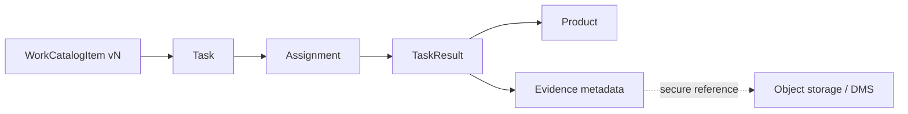

# Task / product / evidence model

- `[FACT]` QĐ01 chỉ xác nhận việc phân công nhiệm vụ gắn vị trí việc làm.
- `[INFERENCE]` Tách catalog, instance, assignment và result để trace/version; evidence lưu metadata + reference thay vì nhét file vào DB.
- `[TBD]` task types, trạng thái, sản phẩm bắt buộc, deadline, acceptance và evidence hợp lệ — chờ 05-HD/TU/Excel.

