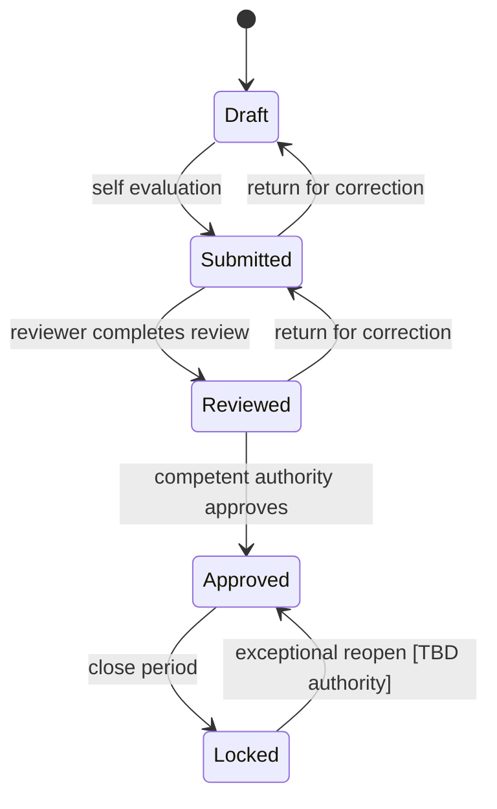

# Workflow mục tiêu

Toàn bộ tên state/action là `[INFERENCE]` để thiết kế demo. QĐ39 phải xác nhận/đổi tên/loại bỏ từng transition. Phần có căn cứ sớm nhất là `organization → assignment` từ QĐ01; phần sau `result → evaluation → classification` bị khóa.

