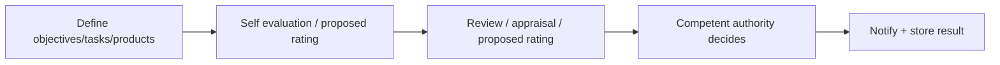
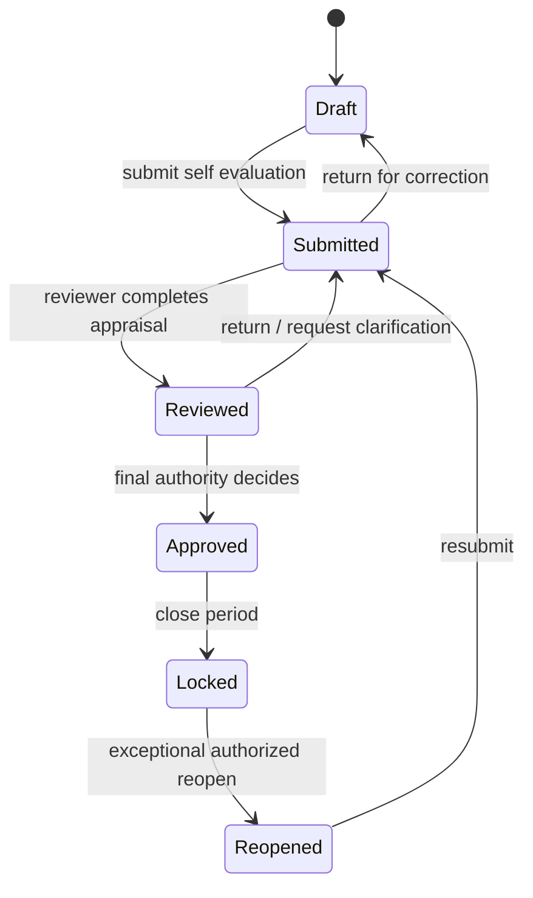

# Evaluation workflow

## Source-derived stages

From 05-HD/TU + QĐ39:



These stages are **FACT at conceptual level**.

## Application state machine [INFERENCE]

The app may implement those stages with:



The English state names and exact transitions above are software design, not terminology copied from the regulations.

## Authority resolution

Do not hard-code:

```text
MANAGER -> approve all employees
```

Instead resolve:

```text
subject
+ organization / position
+ evaluation period
+ competent-authority relationship
+ data scope
→ reviewer / final authority
```

QĐ39 contains different competent authorities for different subject groups.

## Lock/reopen [INFERENCE]

After a final decision, snapshot/rule version/result should be locked. If correction is allowed:

- create reopen request;
- record reason and authority;
- keep previous decision/calculation;
- produce new reviewed/final version;
- full audit trail.

The existence/details of an internal reopen process remain TBD; this is the safest product behavior for preserving traceability.

## Monthly / quarterly / annual

- **Quarter:** formal source-backed workflow from 05-HD.
- **Year:** QĐ39 uses accumulated/periodic results as input to annual classification.
- **Month:** required by the assignment, but exact legal workflow/aggregation is not fully specified in the reviewed sources.

Candidate design: month = operational performance snapshot; quarter/year = formal evaluation periods with versioned rules.
