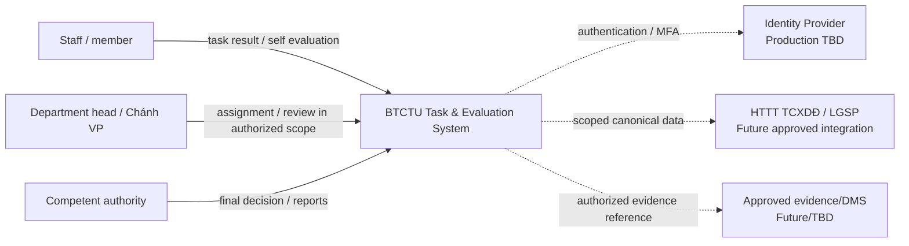
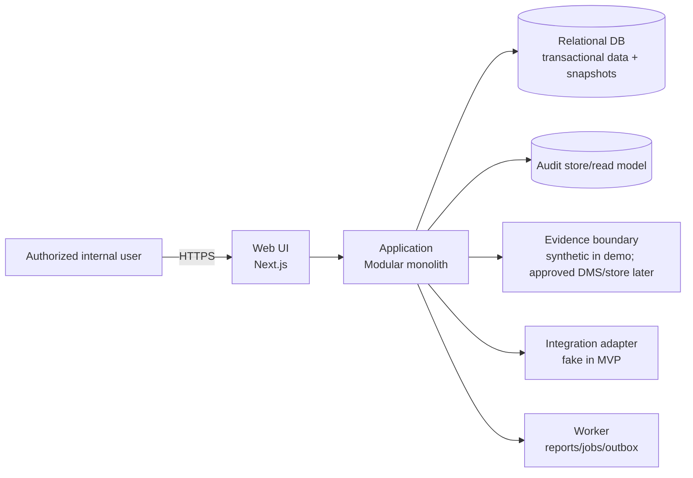

# System context and containers

## Context [INFERENCE based on source roles]

## Application containers [candidate]

## Boundary notes

- “Head” does not automatically equal final approver; authority is resolved by source rules.
- Real state-secret documents are outside prototype scope.
- Real external integration is disabled until production gates are met.
- The container split is an engineering design; QĐ342 supplies architectural/security constraints, not these exact deployable components.
