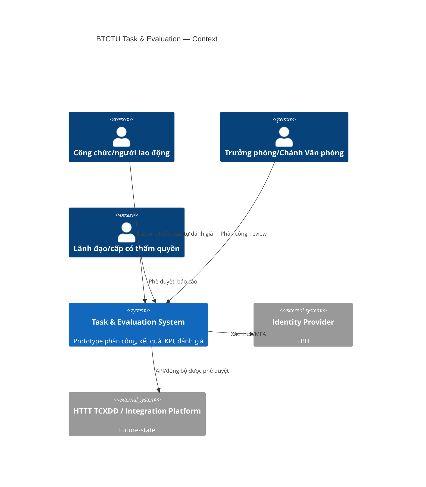
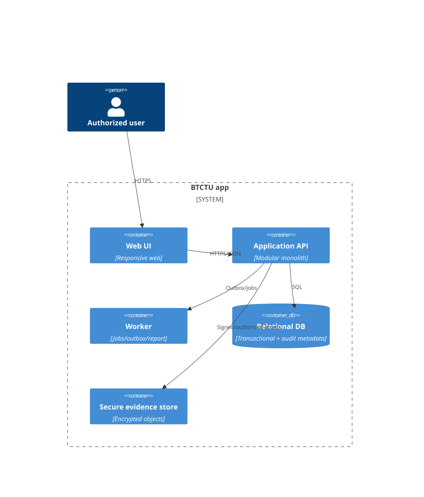

# C4 context và container

```mermaid
C4Context
  title BTCTU Task & Evaluation — Context
  Person(staff, "Công chức/người lao động")
  Person(head, "Trưởng phòng/Chánh Văn phòng")
  Person(leader, "Lãnh đạo/cấp có thẩm quyền")
  System(app, "Task & Evaluation System", "Prototype phân công, kết quả, KPI, đánh giá")
  System_Ext(identity, "Identity Provider", "TBD")
  System_Ext(tcxdd, "HTTT TCXDĐ / Integration Platform", "Future-state")
  Rel(staff, app, "Cập nhật kết quả, tự đánh giá")
  Rel(head, app, "Phân công, review")
  Rel(leader, app, "Phê duyệt, báo cáo")
  Rel(app, identity, "Xác thực/MFA")
  Rel(app, tcxdd, "API/đồng bộ được phê duyệt")
```

```mermaid
C4Container
  Person(user, "Authorized user")
  System_Boundary(s, "BTCTU app") {
    Container(web, "Web UI", "Responsive web")
    Container(api, "Application API", "Modular monolith")
    Container(worker, "Worker", "Jobs/outbox/report")
    ContainerDb(db, "Relational DB", "Transactional + audit metadata")
    Container(files, "Secure evidence store", "Encrypted objects")
  }
  Rel(user, web, "HTTPS")
  Rel(web, api, "HTTPS/JSON")
  Rel(api, db, "SQL")
  Rel(api, files, "Signed/authorized access")
  Rel(api, worker, "Outbox/jobs")
```

Modular monolith là `[INFERENCE]`: đủ rõ boundary, ít vận hành hơn microservices cho bài test.

