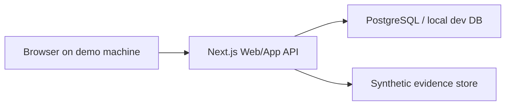
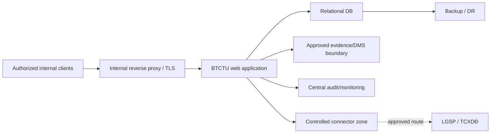

# Deployment architecture — prototype and production target

## Decision [INFERENCE]

Prototype/demo: **internal web application, modular monolith**.

Reasons:

- small/internal user base;
- centralized update/deployment;
- multi-user review/approval fits browser access;
- much less operational overhead than desktop distribution or microservices.

This is an architecture decision for the test, not a rule in the regulations.

## Prototype

No real LGSP, no real personnel data, no state-secret content.

## Production target [subject to approval]

## Production gates

- formal HTTT level assessment/approval;
- approved network/hardware location;
- data inventory + classification;
- access/role matrix;
- backup/DR targets;
- state-secret handling decision;
- approved integration purpose/scope/credentials;
- security testing.

Until those gates are resolved, the production diagram is a **target architecture**, not an assertion that deployment is legally approved.
