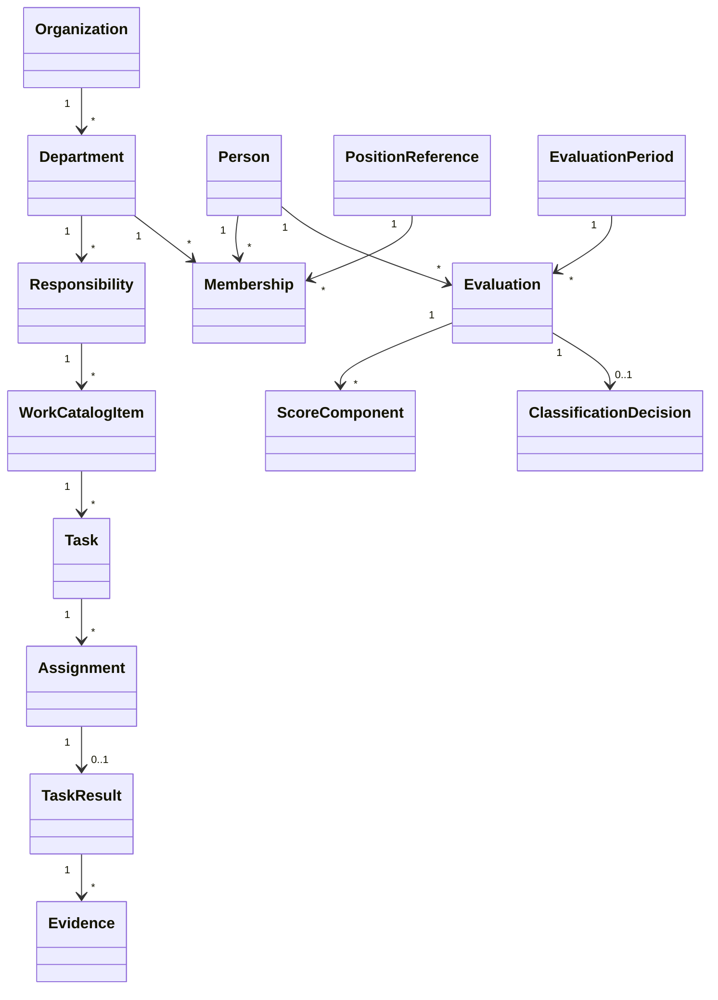

# Domain model

```mermaid
classDiagram
  Organization "1" --> "*" Department
  Department "1" --> "*" Responsibility
  Department "1" --> "*" Membership
  Person "1" --> "*" Membership
  PositionReference "1" --> "*" Membership
  Responsibility "1" --> "*" WorkCatalogItem
  WorkCatalogItem "1" --> "*" Task
  Task "1" --> "*" Assignment
  Assignment "1" --> "0..1" TaskResult
  TaskResult "1" --> "*" Evidence
  EvaluationPeriod "1" --> "*" Evaluation
  Person "1" --> "*" Evaluation
  Evaluation "1" --> "*" ScoreComponent
  Evaluation "1" --> "0..1" ClassificationDecision
```

Các aggregate sau QĐ01 (`Task`, `Evaluation`, `ClassificationDecision`) là design candidate và chỉ hoàn thiện invariant khi có 05/39.

