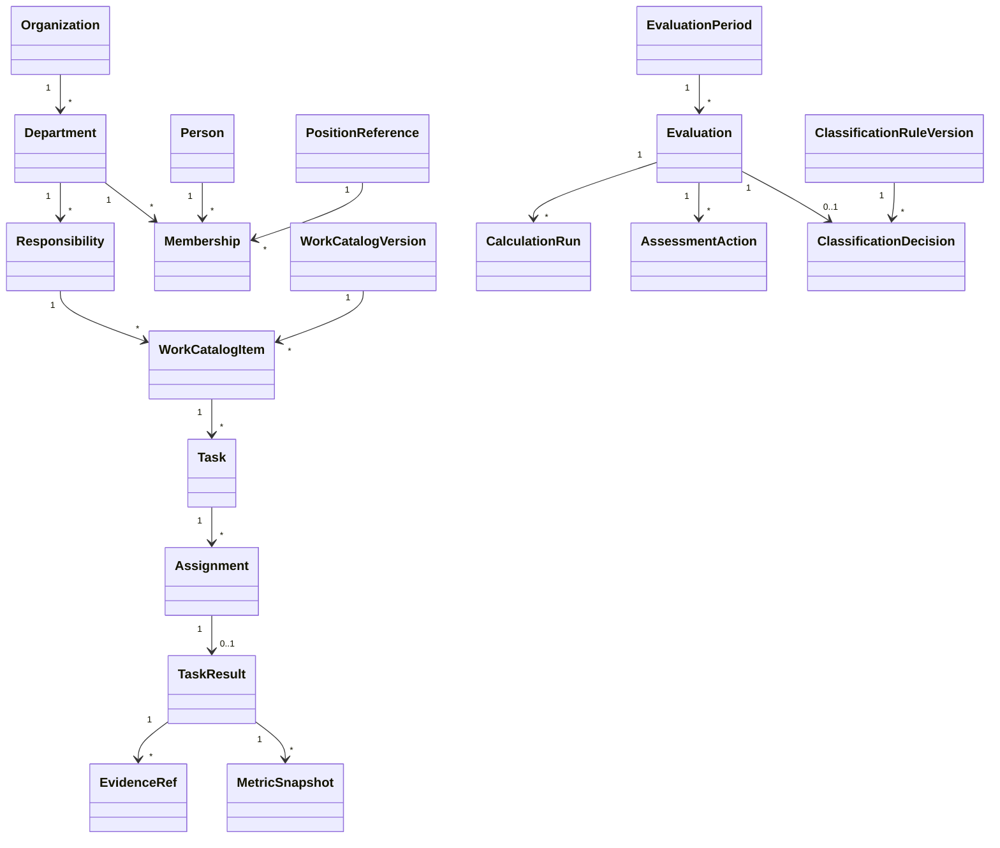

# Domain model

## Aggregates [INFERENCE]

## Aggregate boundaries

### Organization
Owns organization structure/membership references. Person master may ultimately be a projection of authoritative cadre data.

### Work Catalog
Versioned definitions of expected work/product/standard measurement. Publishing a new catalog never changes historical tasks.

### Task
Owns one actual task instance, assignments and result snapshot. Reassignment keeps history.

### Evaluation
Owns one subject+period evaluation, calculation runs, self/review/final decision history and lock state.

### Classification Rules
Versioned thresholds/conditions/blockers. It is referenced by Evaluation rather than embedded as mutable code-only constants.

### Audit
Cross-cutting append-only event store/read model. Business module actions emit audit records through one service.

## Domain invariants

- no final classification without a final competent decision;
- no overwriting approved calculation/decision;
- rule/catalog version is immutable once used by an approved record;
- score threshold alone cannot bypass QĐ39 mandatory conditions;
- technical admin permission does not imply evaluation authority;
- external data cannot silently become locally authoritative.
