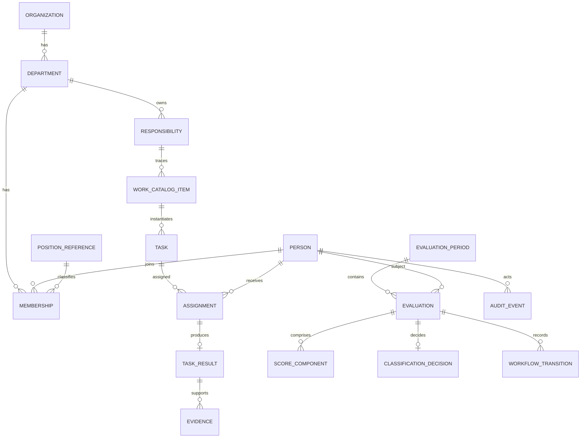

# ERD mục tiêu (logical)

Mọi master/rule quan trọng có `source_ref`, `version`, `effective_from/to`, `status`. Entity nhạy cảm có `classification`, scope và audit; soft-delete không thay thế retention policy.

