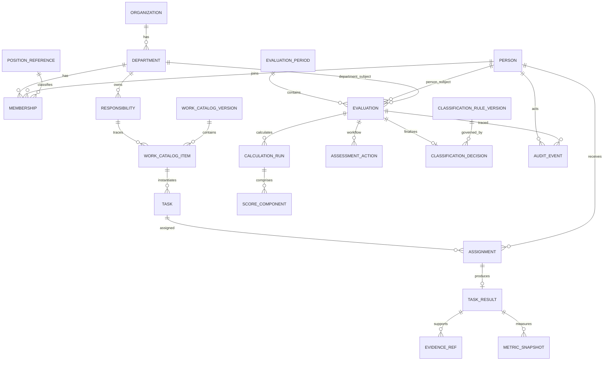

# Logical ERD — target for MVP

> Entity names below are **software design**. Their existence is traceable to source concepts, but the table structure itself is not prescribed by the regulations.

## Source → entity mapping

| Entity | Why it exists |
|---|---|
| Organization / Department / Responsibility | QĐ01 |
| Person / Membership / PositionReference | QĐ01 mentions organization/member/position; authoritative master still TBD |
| WorkCatalogVersion / Item | 05-HD PL1 + operational work catalog |
| Task / Assignment / Result | QĐ01 assignment + 05-HD task/product/result concepts |
| MetricSnapshot | 05-HD A/B/C/D measurement |
| EvaluationPeriod / Evaluation | assignment + 05-HD/QĐ39 |
| CalculationRun / ScoreComponent | 30/70 calculation must be reproducible/versioned |
| ClassificationRuleVersion / Decision | QĐ39 thresholds + conditions |
| AssessmentAction | QĐ39/05 stages |
| AuditEvent | QĐ342 trace requirements |

## Important modeling rules

- `Evaluation.subjectType` is `PERSON` or `DEPARTMENT`; exactly one subject reference applies.
- Approved evaluation keeps the exact catalog/rule/input versions used.
- Recalculation appends a new `CalculationRun`; it does not rewrite history.
- External person/organization data keeps source-system identity/mapping.
- `EvidenceRef` is metadata/reference in MVP; no real secret-document content.
- Delete/retention is policy-driven; “soft delete forever” is not the lifecycle policy.

## Not yet authoritative

- exact PositionReference master;
- non-manager KPI formula;
- monthly aggregation;
- evidence retention;
- production data classification.
