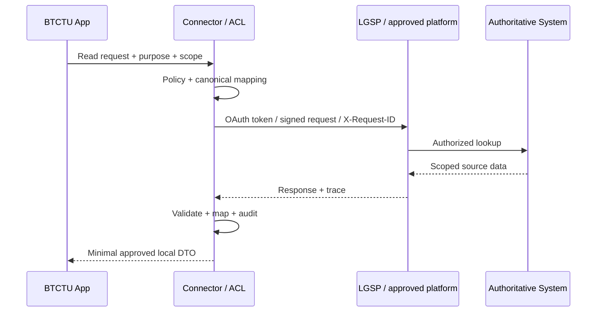

# Integration future-state

## Sources

- QĐ308 — canonical terms/metadata/SOR.
- QĐ607 — concrete OAuth 2.0 `client_credentials`/JWT API contract and scoped data.
- QĐ348 — sharing levels, purpose/scope/approval and authoritative-source principles.
- HD07 — LGSP integration process, X-Request-ID/signature, test→prod, API lifecycle/security.
- NĐ278 — broader mandatory data-sharing governance.

## Candidate architecture [INFERENCE]



## MVP

Use a fake connector implementing the same port:

```text
PersonnelDirectoryPort
  getPerson(externalId)
  listPeopleByDepartment(departmentExternalId)
```

The fake returns synthetic data. No real credentials/endpoints in demo.

## Production adapter requirements

- select authentication/authorization strictly from the approved endpoint and
  platform contract; do not treat the mechanisms listed by QĐ607 and HD07 as
  interchangeable;
- for the QĐ607 APIs: OAuth 2.0 `client_credentials`, Consumer Key/Secret,
  JWT access token and Bearer authorization;
- for an LGSP connection: implement only the approved HD07 mechanism/profile
  (which may involve OAuth 2.1, OIDC 2.0, SAML2, JWT Federation or mTLS);
- correlation/request ID; `X-Request-ID` for LGSP flow.
- signature/certificate where applicable.
- schema/API version registry.
- 401/403/token-expiry handling.
- HTTPS with TLS 1.2 or newer for the QĐ607 contract.
- never put personal data in a query string.
- never log access tokens, passwords or personal data.
- scope/purpose allowlist.
- mapping registry aligned to QĐ308.
- reconciliation/error queue and audit.
- rate limit/retry without uncontrolled retry loops.
- test environment before production.
- credential rotation and revocation.

## SOURCE DIVERGENCE — authentication contract

QĐ607 specifies **OAuth 2.0 `client_credentials`** for its concrete API
contract. HD07 describes a broader LGSP authentication/integration layer that
supports **OAuth 2.1, OIDC 2.0, SAML2, JWT Federation and mTLS**, together with
Bearer authorization and the applicable request-tracing/signature controls.

These statements are not collapsed into a single generic “OAuth2” rule. They
describe different contract layers and are not assumed to be interchangeable.
The production connector must follow the exact version, profile and mechanism
approved for its endpoint/platform.

## API lifecycle

HD07 states structural API changes use versioning and old version is maintained in parallel for a transition period (source specifies minimum 180 days). Connector code must therefore be tolerant of parallel contract versions.

## Data ownership

Do not copy authoritative person/organization data as if locally owned. Also
do not assign one source to the whole `Person` aggregate by default: the
authoritative source may differ by field or dataset.

Local projections should therefore carry field/dataset-level provenance, for
example:

`field/dataset, sourceSystem, externalId, syncedAt/sourceVersion, mappingVersion`.

Local app owns task/evaluation records it creates; external master data remains source-owned.

## Gate

Real integration remains OFF until:

- connection/purpose/scope approved;
- exact API subset confirmed;
- network/cert/credentials supplied through approved mechanism;
- ATTT/data classification review passed.
