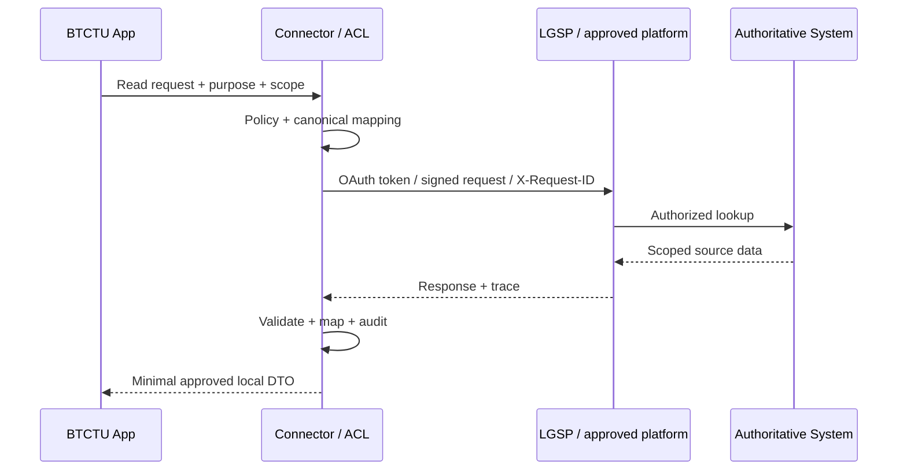

# Integration future-state

## Sources

- QĐ308 — canonical terms/metadata/SOR.
- QĐ607 — concrete OAuth2/JWT API contract and scoped data.
- QĐ348 — sharing levels, purpose/scope/approval and authoritative-source principles.
- HD07 — LGSP integration process, X-Request-ID/signature, test→prod, API lifecycle/security.
- NĐ278 — broader mandatory data-sharing governance.

## Candidate architecture [INFERENCE]



## MVP

Use a fake connector implementing the same port:

```text
PersonnelDirectoryPort
  getPerson(externalId)
  listPeopleByDepartment(departmentExternalId)
```

The fake returns synthetic data. No real credentials/endpoints in demo.

## Production adapter requirements

- OAuth2 client credentials / Bearer JWT per QĐ607.
- correlation/request ID; `X-Request-ID` for LGSP flow.
- signature/certificate where applicable.
- schema/API version registry.
- 401/403/token-expiry handling.
- scope/purpose allowlist.
- mapping registry aligned to QĐ308.
- reconciliation/error queue and audit.
- rate limit/retry without uncontrolled retry loops.
- test environment before production.
- credential rotation and revocation.

## API lifecycle

HD07 states structural API changes use versioning and old version is maintained in parallel for a transition period (source specifies minimum 180 days). Connector code must therefore be tolerant of parallel contract versions.

## Data ownership

Do not copy authoritative person/organization data as if locally owned. Local projection records should identify:

`sourceSystem, externalId, syncedAt/sourceVersion, mappingVersion`.

Local app owns task/evaluation records it creates; external master data remains source-owned.

## Gate

Real integration remains OFF until:

- connection/purpose/scope approved;
- exact API subset confirmed;
- network/cert/credentials supplied through approved mechanism;
- ATTT/data classification review passed.
