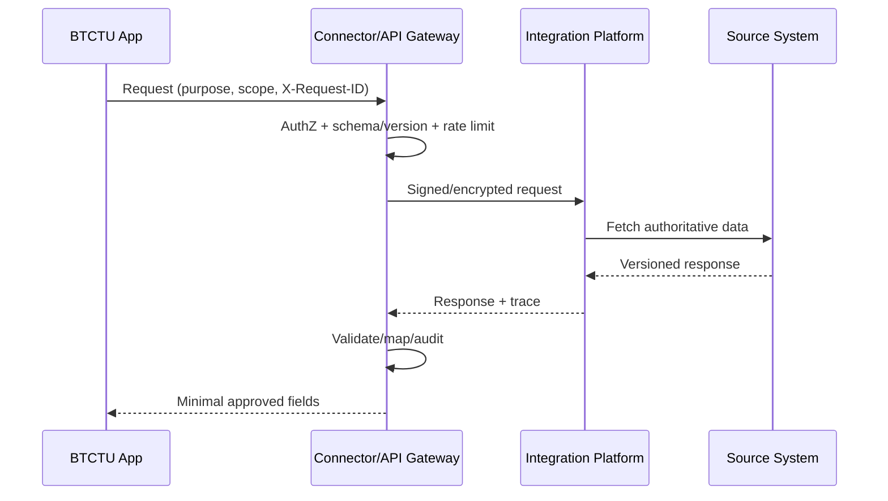

# Integration future-state

MVP dùng fake adapter và contract tests. Production cần: đăng ký/duyệt kết nối, non-production test data, canonical mapping QĐ308/QĐ607, idempotency/retry/dead-letter, reconciliation, DC/DR, monitoring và incident handling theo HD07/QĐ348.

