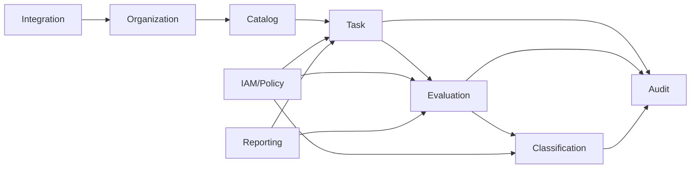

# Module boundaries — modular monolith

| Module | Owns | Main source |
|---|---|---|
| Organization | organization, department, person projection, membership, position ref | QĐ01 + QĐ342 authoritative-data principle |
| Responsibility & Catalog | responsibility, catalog version/item | QĐ01 + 05-HD PL1 + Excel |
| Task | task, assignment, result, product/evidence reference, metric snapshot | QĐ01 + 05-HD |
| Evaluation | period, 30/70 snapshots, calculation run, assessment actions | 05-HD + QĐ39 |
| Classification | versioned threshold/condition rules, eligibility checks, final class candidate | QĐ39 |
| IAM / Policy | identity link, role, grant, data scope, policy decision | QĐ342 |
| Audit | access/action events, security/business trace | QĐ342 + data/security sources |
| Reporting | dashboard/report/export read models | test assignment + approved data only |
| Integration | connector, canonical mapping, sync/reconciliation | QĐ308/607 + QĐ348 + HD07 |
| Configuration | source refs, rule versions, feature gates | design choice for traceability |

## Dependency direction

## Rule

Modules do not directly mutate another module’s tables. Coordination happens through application services and domain/application events inside one deployable unit.

No microservices are required for the test. Boundaries are maintained to make later extraction possible only if scale/integration demands it.
