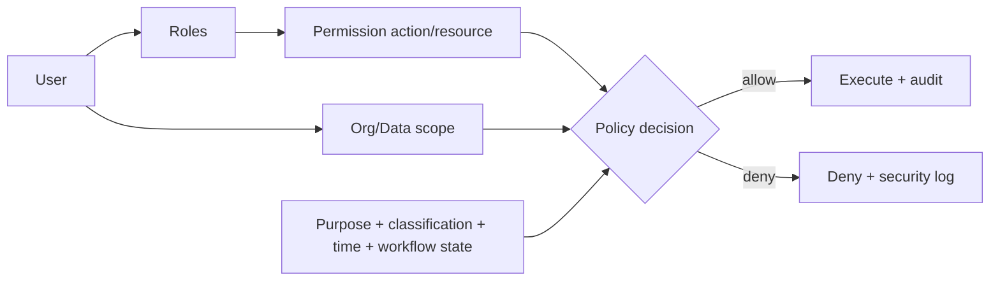

# Permission and data-scope model

## Source constraints [FACT]

QĐ342 Điều 16 requires authorization based on:

- role;
- task;
- data scope;
- secrecy/classification;
- usage period;
- least privilege / right person / right job / right time / right purpose.

A user may have multiple roles. Rights need review/revoke when job/authority changes. Access, extraction, update, approval, sharing and processing must be logged.

QĐ348 further constrains data sharing by approved purpose, recipient, scope and sharing level.

## Candidate policy model [INFERENCE]



### Policy input

```text
principal:
  userId
  roles[]
  memberships[]
  grants[]

request:
  action
  resourceType/id
  organizationScope
  dataClassification
  purpose
  workflowState
  timestamp
```

## Candidate roles

Role names such as `SYSTEM_ADMIN`, `STAFF`, `DEPARTMENT_HEAD`, `REVIEWER`, `APPROVER`, `DATA_ADMIN` are **software design**, not a list issued by QĐ342.

Important separation:

- technical system admin does **not** automatically have business authority to change KPI/final classification;
- assignment responsibility from QĐ01 does not prove exclusive software permission;
- reviewer/approver relationships are resolved using QĐ39 authority rules.

## High-risk actions

Always explicit permission + reason/audit:

- access sensitive/special dataset;
- export/print;
- change permissions;
- override score;
- final decision;
- reopen locked evaluation;
- connector/data-share request.

## TBD

Official role/action matrix, delegation rules, data-classification labels and privileged-access review cadence for this specific deployment.
