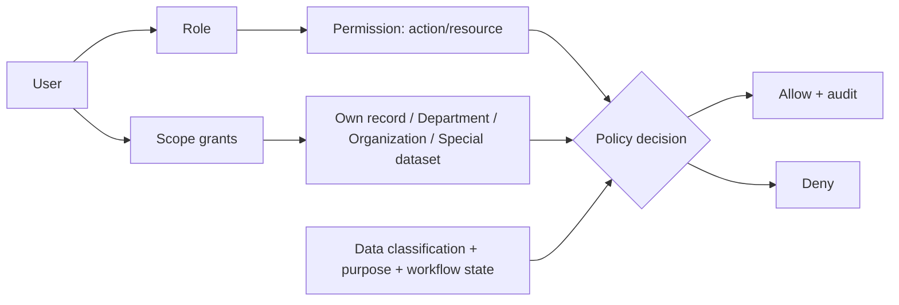

# Permission và data-scope model

- `[FACT]` QĐ342 yêu cầu định danh/xác thực/phân quyền và MFA cho privileged/sensitive accounts; QĐ348 yêu cầu đúng mục đích/phạm vi/đối tượng và phân quyền theo dữ liệu/mức chia sẻ.
- `[INFERENCE]` RBAC + scope + contextual policy, deny-by-default.
- `[TBD]` ma trận role/action thật, delegation, trường đặc biệt; QĐ01 không chứng minh “chỉ Trưởng phòng được assign” theo nghĩa permission độc quyền.

