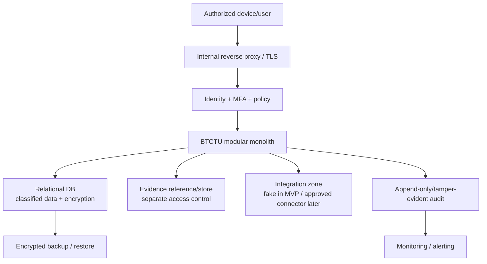

# Security architecture

## Security posture

Prototype is deliberately **not** a state-secret document management system and uses synthetic data only.

Production-connected design prepares for stronger controls, but the project must not claim an officially approved ATTT level until the formal dossier/authority confirms it.

## Source constraints

- QĐ342: MFA for privileged/sensitive accounts; logging/trace; network separation; encryption, backup, incident handling.
- QĐ348/HD07: systems participating in Party data connection must meet the connection/security process and target ATTT from level 3.
- NĐ85: level is determined by actual information/function/impact; state-secret processing is a level-3 criterion.
- NĐ63: electronic state-secret documents have dedicated handling/device/network processes.
- NĐ165: access history, encryption and data lifecycle.
- NĐ278: secure controlled data sharing.

## Candidate architecture [INFERENCE]

## Control baseline

### Identity / access
- MFA for privileged/sensitive use.
- deny-by-default.
- role + scope + purpose + classification + state.
- session timeout/revocation.
- periodic access review.

### Application
- validation/authorization server-side.
- CSRF/session/secure header controls.
- safe file handling, type/size checks and malware scan if upload exists.
- no secrets in repo/client.
- rate limiting for sensitive/export operations.

### Data
- encryption in transit and at rest.
- separate keys/secrets management.
- minimize sensitive data.
- immutable/tamper-evident audit.
- backup + restore drills.

### Network/operations
- management zone separated from normal user access.
- patch/vulnerability/dependency scanning.
- incident runbook.
- environment separation: dev/test/prod.
- synthetic test/demo data.

## State-secret boundary

MVP stores no real state-secret content.

If production must handle it, architecture must be re-reviewed against NĐ63 and approved network/device/DMS controls. A metadata reference to an approved document system is preferable to copying secret files into this app.

## AI boundary

If report drafting uses AI:

- prototype only uses synthetic/non-sensitive input;
- production requires approved AI environment;
- AI result is draft/support only and must be human reviewed;
- log AI use according to applicable policy.
