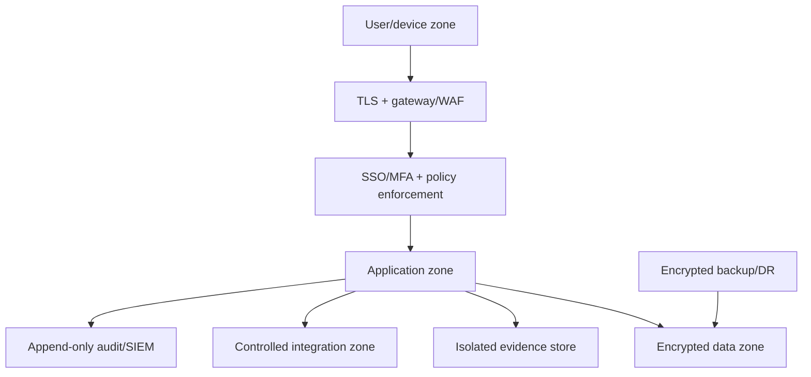

# Security architecture

Controls: least privilege, network segmentation, secrets manager, secure headers/session, validation/anti-malware for upload, encryption/key rotation, backup restore drills, vulnerability/dependency scanning, patching, incident runbook, synthetic demo data.

Gates:

1. Prototype: threat model + baseline controls.
2. Pilot: formal data inventory/classification and privacy/secrecy review.
3. Production: approved ATTT level dossier/plan; approved deployment/network/integration; tested DR and incident response.

