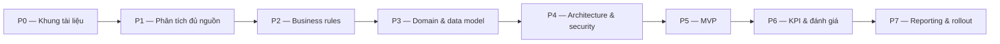

# 06 — Kế hoạch triển khai

> Kế hoạch bám theo ranh giới fact/inference/TBD: giai đoạn nào phụ thuộc tài liệu chưa có thì không thể bắt đầu code phần đó.

## Tổng quan các giai đoạn

## Chi tiết từng giai đoạn

| Giai đoạn | Mục tiêu | Điều kiện bắt đầu | Sản phẩm đầu ra | Điều kiện kết thúc |
|---|---|---|---|---|
| P0 — Khung tài liệu | Dựng bộ docs, quy ước, branch | — (đang làm) | docs/ hiện tại | Repo + docs README sẵn sàng |
| P1 — Phân tích đủ nguồn | Phân tích 05-HD/TU, 39-QĐ/TU, văn bản an ninh | Có file văn bản | File phân tích SRC-02, 03, 04 | Mọi TBD nghiệp vụ có chủ sở hữu |
| P2 — Business rules | Chốt task model, KPI, quy trình đánh giá | P1 | Bảng business rules có nguồn | Không còn suy luận nghiệp vụ treo |
| P3 — Domain & data model | Hoàn thiện ERD, từ điển dữ liệu | P2 | ERD đầy đủ, data dictionary | Review đạt |
| P4 — Architecture & security | Chốt ADR-0004, phân quyền, triển khai | P3 + văn bản CNTT/an ninh | ADR, sơ đồ C4, security design | Quyết định kiến trúc được phê duyệt |
| P5 — MVP | Code Organization + Responsibility + Assignment | P4 | App chạy nội bộ demo | Demo được kịch bản phân công |
| P6 — KPI & đánh giá | Code KPI, chấm điểm, xếp loại, phê duyệt | P5 + P2 rules | Tính năng KPI/evaluation | Đúng business rules P2 |
| P7 — Reporting & rollout | Báo cáo định kỳ/đột xuất, dashboard Văn phòng, triển khai thật | P6 | Báo cáo, hướng dẫn, rollout | Vận hành thật tại cơ quan |

## Decision gates (điểm quyết định)

| Gate | Khi nào | Quyết định gì | Liên quan |
|---|---|---|---|
| G1 | Kết thúc P4 | Web app hay desktop app | ADR-0004 |
| G2 | Bắt đầu P5 | Ngăn xếp công nghệ (stack) | ADR mới |
| G3 | Bắt đầu P6 | Cách xử lý dữ liệu nhạy cảm BVCTNB | Văn bản an ninh |

## Nguyên tắc

- Không code giai đoạn sau trước khi gate tương ứng được quyết.
- Mỗi giai đoạn có ít nhất một buổi review đối chiếu với văn bản nguồn.
- MVP (P5) chọn đúng 3 module đã có căn cứ từ QĐ01 — đây là lý do MVP khả thi sớm.

