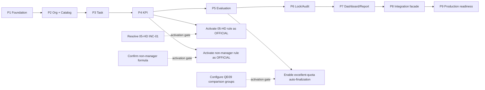

# Implementation plan — build the defensible vertical slice first

Related implementation decisions:

- [Technical stack](technical-stack.md)
- [Code plan](code-plan.md)

## Goal

Deliver a demo that proves:

```text
source regulation
→ business rule
→ domain model
→ implementation
→ visible audit/decision
```

The project is a competency test, not a production replacement for the whole HTTT TCXDĐ. Scope is therefore intentionally narrow and traceable.

## MVP vertical slice

```text
Organization / Position / Person
        ↓
Versioned Work Catalog
        ↓
Task Assignment
        ↓
Task Result / Product / EvidenceRef
        ↓
KPI Calculation
        ↓
Self Evaluation
        ↓
Review / Appraisal
        ↓
Classification Eligibility
        ↓
Final Decision
        ↓
Lock + Audit
        ↓
Dashboard / Report
```

## Phase plan

### P0 — Evidence baseline — DONE for design branch

Deliverables:

- source register;
- source analysis for QĐ01, 05-HD, QĐ39, QĐ342, QĐ348, QĐ308, QĐ607, HD07, NĐ85/63/165/278, NQ11;
- Excel operational analysis;
- FACT / INFERENCE / TBD convention;
- source inconsistency register.

Exit gate:

- every core business rule has a source reference or an explicit TBD/design label.

### P1 — Application foundation

**Candidate tech:** internal web app, Next.js + TypeScript + relational DB; modular monolith.

Deliver:

- project skeleton;
- DB migrations;
- seed/synthetic demo data;
- auth/session stub;
- centralized policy interface;
- audit-event API;
- CI: lint/typecheck/unit tests.

Do not build real SSO/LGSP yet.

### P2 — Organization + catalog

Implement:

- Organization / Department;
- Person projection / Membership / PositionReference;
- Responsibility catalog;
- WorkCatalogVersion / WorkCatalogItem;
- admin screen/import staging for the supplied work-catalog Excel.

Rules:

- imported workbook starts as DRAFT;
- publish version explicitly;
- historical task keeps catalog version;
- do not claim Excel scores are official until approved.

Demo checkpoint:

> recruiter can trace a catalog item back to source/workbook and see version/effective status.

### P3 — Task execution

Implement:

- create task from catalog;
- assign/reassign within allowed scope;
- staff inbox;
- progress/result;
- actual quantity/completion time;
- product + EvidenceRef metadata;
- acceptance/rework comment;
- full assignment/result audit.

Source basis: QĐ01 + 05-HD + QĐ308.

Keep task state names clearly labeled as product design.

### P4 — KPI engine

Implement versioned deterministic calculation:

- General criteria block (max 30);
- Work performance block (max 70);
- A/B/C/D metric snapshot **for leader scenario**;
- CalculationRun with rule/input snapshot;
- score explanation UI.

Required tests:

- boundary values;
- missing metric;
- rounding policy;
- historical rule version;
- source worked example.

INC-01 **does not block implementation of P4**. Build the generic engine,
`ScoringRuleVersion`, input/rule snapshots, explanation UI and tests using a
rule with `status = CANDIDATE`.

INC-01 blocks only activation/publication of the affected rule as
`OFFICIAL/ACTIVE`. Until confirmed, show a visible “worked-example discrepancy /
candidate rule” flag in demo config.

For non-manager staff, use a separate candidate/configured rule; never label it official unless business confirms it.

### P5 — Evaluation + classification

Implement:

- self evaluation;
- reviewer appraisal/proposal;
- final competent decision;
- QĐ39 score bands;
- mandatory-condition / blocker checks;
- classification explanation: “why this class”;
- person and department subject types.

Do **not** automate excellent-quota finalization until the exact comparison group is configured.

### P6 — Lock / reopen / audit

Implement:

- finalize/lock period;
- edits denied after lock;
- authorized reopen request with reason;
- keep old run/decision;
- append audit timeline;
- permission denied demo path.

Exact reopen authority is a local design/TBD, so prototype can use a controlled demo role with clear label.

### P7 — Dashboard + report/template draft

Implement:

- personal summary;
- department summary;
- period status;
- score/classification distribution;
- pending review/decision;
- trace links to source/rule versions;
- export report using synthetic data;
- draft report/decision template.

If AI drafting is shown:

- synthetic data only;
- output marked DRAFT;
- human approval mandatory;
- no public AI with protected production data.

### P8 — Integration facade

Implement only:

- canonical mapping registry;
- fake `PersonnelDirectoryPort`;
- fake QĐ607-style adapter;
- contract-profile tests with mocks: QĐ607 OAuth 2.0
  `client_credentials`/JWT behavior and a separate approved LGSP profile
  boundary;
- X-Request-ID/correlation ID.

No real connection in test scope.

### P9 — Security hardening / production-readiness pack

Prepare, do not claim completion without authority:

- data inventory/classification;
- formal HTTT-level dossier inputs;
- threat model;
- privileged MFA integration;
- network/deployment review;
- backup/restore test;
- vulnerability/dependency scans;
- incident runbook;
- secret-document boundary decision;
- real integration approval.

## Dependency graph



## MVP cut line for interview

If time is short, finish **P1–P7** with one happy path and one exception path. P8 can be a diagram + fake port. P9 remains a readiness plan.

### Must-show scenarios

1. head assigns work;
2. staff submits result/product;
3. system calculates explainable score;
4. reviewer returns once, then reviews;
5. final authority decides;
6. period locks;
7. attempted edit is denied and audited;
8. dashboard updates;
9. source/rule version is visible.

## Explicit non-goals

- microservices;
- generic rule DSL;
- event sourcing;
- full DMS;
- real state-secret data;
- real LGSP integration;
- complex ML/AI decision-making.

These do not improve the competency-test signal enough to justify risk/complexity.
