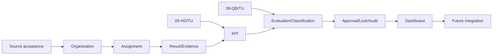

# Implementation plan — vertical slice trước, rule sau

Xem thêm:

- [Technical stack](technical-stack.md)
- [Code plan](code-plan.md)

## MVP đề xuất

Demo bằng dữ liệu giả: organization → membership/position placeholder → catalog item → assignment → result/product/evidence metadata → configurable KPI → self evaluation → review → classification → approval → lock → audit → dashboard.

KPI/classification demo phải có banner `candidate rule — not official` cho đến khi 05/39 được duyệt.

| Phase | Deliverable | Dependency/source | Gate |
|---|---|---|---|
| 0. Evidence baseline | Source register, trace IDs, unknown register | Tất cả nguồn | File 05/39/Excel hoặc xác nhận mock-only |
| 1. Foundation | project skeleton, CI, auth stub, audit envelope | Design choice + QĐ342 | Threat model reviewed |
| 2. Organization | org/department/person/membership/position ref/responsibility | QĐ01 | Source acceptance tests |
| 3. Assignment slice | work catalog v1, task, assignment, inbox | QĐ01 + Excel TBD | Không claim task taxonomy official |
| 4. Result/evidence | result/product/evidence metadata, secure upload stub | 05 TBD + design | Upload controls/test data |
| 5. KPI | criterion/formula versions, reproducible calculation | 05 required | Approved rule table |
| 6. Evaluation | self/review/classification/approve/return/lock | 39 required | Approved state/rule matrix |
| 7. Audit/report | timeline, overrides, export, department/dashboard read models | QĐ342 + approved workflow | Permission tests |
| 8. Integration | connector contracts, fake service, mapping registry | 308/607/07/348 | Real connector remains off |
| 9. Hardening | ATTT dossier inputs, security/perf/backup/DR tests | 85/63/165/278 | Production authority |

## Dependency order

## Source-derived vs candidate

| Feature | Classification |
|---|---|
| Four departments/functions/responsibilities | Source-derived: QĐ01 |
| Head/Chief Office assigns member linked to position | Source-derived responsibility: QĐ01 Điều 7.2; software exclusivity TBD |
| Modular monolith, web UI, outbox, evidence store | Candidate design |
| Task/result/product schema | Candidate pending 05/Excel |
| KPI formula | Must be source-derived from 05; blocked |
| State machine/classification | Must be source-derived from 39; blocked |
| MFA/audit/architecture layers | Source constraint QĐ342; implementation design local |
| API mapping/connector | Source constraints 348/308/07; exact contract 607 TBD |

## Không over-engineer

- Không microservices/event sourcing/general rules engine.
- Không tích hợp thật hay dữ liệu thật.
- Không full document-management system; chỉ evidence metadata + secure object reference.
- Một happy path + return-for-correction + permission-denied + audit trail là đủ mạnh để bảo vệ.
