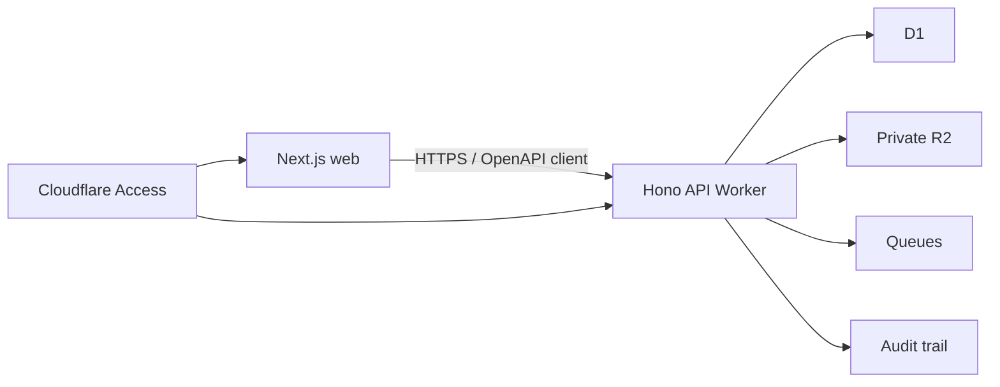

# Technical stack

## Quyết định ngắn

| Layer | Chọn | Lý do |
|---|---|---|
| Frontend | Next.js App Router + TypeScript | Hệ sinh thái mạnh, phù hợp dashboard/form |
| Frontend deployment | Static/client-heavy Next.js trên Cloudflare; đánh giá vinext trước khi dùng SSR | API đã tách riêng; giảm phụ thuộc adapter runtime |
| API | Hono trên Cloudflare Workers | Nhẹ, Cloudflare-native, TypeScript-first |
| API contract | REST `/api/v1` + OpenAPI + Zod | Dễ test, demo, tích hợp và sinh client |
| Database MVP | Cloudflare D1 + Drizzle ORM | Relational, migration rõ, vận hành tối giản |
| Database production option | PostgreSQL qua Hyperdrive | Chọn nếu pilot yêu cầu DB engine/HA/backup/governance ngoài khả năng D1 được phê duyệt |
| Evidence files | Private R2 | Tách metadata khỏi file; download/upload có authorization |
| Async jobs | Cloudflare Queues | Báo cáo, notification, import và hậu xử lý; consumer phải idempotent |
| Authentication edge | Cloudflare Access + IdP | SSO/MFA/deny-by-default cho ứng dụng nội bộ |
| Authorization app | RBAC + organization/data scope + context | Access chỉ xác thực cửa ngoài; API vẫn quyết quyền nghiệp vụ |
| Scheduled jobs | Workers Cron Triggers | Đóng kỳ, reminder, reconciliation |
| Observability | Workers Logs/Traces + structured logs | Correlation ID, lỗi và latency |
| Tests | Vitest + Cloudflare Vitest plugin + Playwright | Chạy logic/bindings trong Workers runtime và E2E trình duyệt |
| Deploy/config | Wrangler + GitHub Actions | Ít công cụ, preview/staging/production tách biệt |

## API: chọn Hono, không chọn Next.js Route Handlers



Lý do:

- frontend/backend deploy độc lập và API boundary rõ;
- API tương lai có thể phục vụ integration hoặc client khác;
- Hono chạy trực tiếp trên Workers và có ít abstraction không cần thiết;
- OpenAPI thể hiện contract tốt hơn tRPC trong portfolio và phù hợp future API sharing.

Không chọn:

- **NestJS:** nặng và Node-centric hơn nhu cầu của Workers/MVP;
- **Express:** không phải lựa chọn Workers-native tốt nhất;
- **tRPC:** rất tốt cho monorepo TypeScript, nhưng contract khó dùng hơn với hệ thống ngoài;
- **GraphQL:** chưa có nhu cầu query graph/federation đủ lớn;
- **microservices:** tăng vận hành mà chưa tạo giá trị cho vertical slice.

## Frontend

- Next.js App Router, TypeScript strict.
- Tailwind CSS + shadcn/ui cho design system; không chỉnh trực tiếp component vendor khi có thể bọc lại.
- TanStack Query cho server state; không đưa toàn bộ API state vào global store.
- React Hook Form + Zod cho form/schema ở client.
- TanStack Table cho task/evaluation/audit grids.
- URL giữ filter/sort/page để link và back/forward hoạt động đúng.
- Client API được sinh từ OpenAPI; không tự viết nhiều kiểu dữ liệu trùng API.

Ứng dụng là dashboard nội bộ nên SSR không phải dependency cốt lõi. Bắt đầu bằng static/client-heavy deployment. Chỉ bật SSR/Server Actions sau compatibility spike trên Cloudflare và khi có use case rõ.

## Backend

- Hono middleware chain: request ID → Access JWT verification → actor mapping → authorization → validation → handler → audit/metrics.
- Application services điều phối use case; domain không phụ thuộc Hono, D1 hay Cloudflare bindings.
- Drizzle schema/migrations; repository interface giúp đổi D1 sang PostgreSQL nếu production gate yêu cầu.
- RFC 7807-style problem response, idempotency key cho mutation nhạy cảm/import/integration.
- Optimistic concurrency/version column cho approve, lock và update quan trọng.
- Audit ghi cùng use case; side effect bất đồng bộ dùng transactional-outbox pattern phù hợp khả năng DB được chọn.

## Data/storage

### D1

Dùng cho MVP vì dataset bài test nhỏ, quan hệ rõ và Cloudflare binding đơn giản. Không bật read replication trong MVP. Trước pilot phải đánh giá:

- transaction/concurrency của approval/locking;
- backup/restore và RPO/RTO;
- data location/jurisdiction;
- reporting volume;
- yêu cầu công cụ vận hành/DBA.

Nếu không đạt gate, chuyển sang PostgreSQL và kết nối từ Workers bằng Hyperdrive; domain/API không đổi.

### R2

- bucket private; object key không chứa dữ liệu nhạy cảm;
- D1 chỉ giữ metadata, checksum, media type, size, classification và object key;
- API cấp quyền trước khi tạo URL ngắn hạn;
- giới hạn size/type, checksum, quarantine/status scan;
- MVP có thể chỉ upload file giả hoặc metadata cho đến khi có quy trình malware scanning được duyệt.

### KV

Chỉ dùng nếu cần cache cấu hình không nhạy cảm/danh mục đọc nhiều. Không dùng KV làm nguồn thật cho permission, workflow, điểm hoặc audit.

### Queues

Các job: tạo báo cáo, import master data, notification và integration retry. Queue có thể giao lại message nên consumer bắt buộc dùng idempotency key/deduplication.

## Authentication và authorization

1. Cloudflare Access bảo vệ cả hostname web và API, liên kết IdP tổ chức và yêu cầu MFA.
2. API tự xác minh JWT Access, gồm signature, issuer và audience.
3. Email/subject từ Access map sang `UserIdentity`.
4. Policy engine nội bộ kiểm tra `action + resource + scope + context`.
5. Không tin role do frontend gửi lên.

Local development dùng signed test identity hoặc dev-only auth adapter; adapter này không được build/deploy vào production.

## Monorepo

```text
apps/
  web/                 Next.js
  api/                 Hono Worker
packages/
  contracts/           OpenAPI schemas + generated client
  domain/              entities, value objects, policies
  db/                  Drizzle schema, migrations, repositories
  auth/                identity and authorization contracts
  observability/       logger, trace, audit envelope
  config/              shared TypeScript/ESLint config
tools/
  excel-import/        Node CLI: Excel -> validated staging JSON
```

`pnpm` workspace là đủ; chưa cần Turborepo. Excel được parse bằng Node CLI ở bước quản trị/offline, không parse workbook lớn trong request Worker. CLI tạo manifest/checksum/validation report rồi API import staging JSON.

## Quality toolchain

- TypeScript strict, ESLint, Prettier, commitlint tùy nhu cầu.
- Vitest cho domain/application; Cloudflare Vitest plugin cho bindings.
- Playwright cho 3 luồng: happy path, return-for-correction, permission denied.
- OpenAPI contract tests; migration test trên DB sạch.
- GitHub Actions: install → lint → typecheck → unit → integration → build → E2E preview.
- Dependabot/Renovate, dependency audit và secret scanning.

## Môi trường

| Environment | Data | Cloudflare resources |
|---|---|---|
| Local | synthetic fixtures | local bindings/Miniflare |
| Preview PR | synthetic, resettable | preview Worker, isolated DB/bucket nếu cần |
| Staging | synthetic/approved masked | riêng D1/R2/Queue/Access app |
| Production | data thật sau approval | resource riêng, least privilege, deployment gate |

Không dùng chung database/bucket/secrets giữa staging và production.

